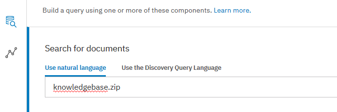

[](https://travis-ci.org/IBM/virtualhelpdesk)

# Locating Information Efficently and Precisely - Splitting and Ingesting Segments of PDF File into Watson Discovery

Splitting and ingesting each segment of a PDF file as individual document into Watson Discovery collection can improve query efficency and identify information more precisely. 

In this Code Pattern, we walk you through configuration steps of Watson Discovery service in order to split segments in PDF documents and ingest them into Discovery service as individual document automatically. It eliminates the manual tasks of splitting PDF file as it can be part of the common customer requirements. 

After Discovery service configuration, you verify the splitting PDF segmentations through the Discovery service UI and see how efficently and precisely to query information.

Optionally, Watson Knowledge Studio model can be deployed to Discovery service to improve data ingestion and query.

When you complete this code pattern, you will understand how to:
* Configure a Watson Discovery service to automatically split PDF file and ingest them as inidvidual documents
* Load and enrich data in the Watson Discovery Service.
* Query and manipulate data in the Watson Discovery Service.


## Benefits of Splitting Documents

IBM Watson Discovery makes it possible to rapidly build cognitive, cloud-based applications that unlock actionable insights hidden in unstructured data. It only takes a few steps to prepare your unstructured data, create a query that will pin-point the information you need, and then integrate those insights into your new application or existing solution.

Sometimes, documents are big and it makes harder for the Discovery service to identify quick answers to questions. These documents could be user manuals, frequently asked questions, catalogs, or many more. However, information in these documents is typically organized into sections that cover a specific topic. These specific topics can be very useful in an application that is designed to get the user to an answer quickly. This leads to Document Segmentation (manually or via Document Segmentation feature of Discovery service) to accurately ingest, enrich and analyze the documents in their logical parts.

The Document Segmentation feature splits an unstructured document into useful chunks that are then enriched and stored as individual searchable results. This feature can also result in improved result ranking when performing relevancy training (specifically for natural language query) as the training is performed on segmented and information-specific portions of documents instead of the entire general document.


## Use Case

A car manual contains information of all major components. When the entire car manual is stored as one piece in the Discovery collection and an end user searches for tire information, it retrieves the whole document and take additional effort to pin-point the relevant information. On the other hand, when a specific subject (one segment of the car manual) is stored individually in the Discovery collection and the end user searches for tire information, the information can be pin-pointed precisely and easily. Only relevant information is retrieved.

You have two options: manually split and save each subject as a separate document so that they can be uploaded to Watson Discovery collection individually. Or, use the Document Segmentation feature of Discovery service to segment the original document based on headings within the document.

To automate the slitting and ingesting tasks, you can configure the <h> tags of the documents or change the rules on how the Discovery service splits their documents. Once broken down, each segment will be treated as a separate document that will be enriched and indexed separately. Document Segmentation will segment each time the specified <h> tag(s) are detected.


## Flow
1. Administrator configures Watson Discovery service.
1. PDF files are loaded into Discovery collection. Segments in PDF files are ingested into Discovery collection as individual documents.
1. Enhanced data in Discovery collection is rendered to your aplication.
1. Each segment in the PDF documents can be presented as an individual document to your application.
1. The user interacts with the data in Discovery server via your application.


## Included Components
* [Watson Discovery](https://www.ibm.com/watson/developercloud/discovery.html): A cognitive search and content analytics engine for applications to identify patterns, trends, and actionable insights.
* [Watson Discovery Configuration](https://console.bluemix.net/docs/services/discovery/building.html#configuring-your-service): Split segments in PDF files and ingest them as individual documents into Discovery collection.

## Featured technologies
* [Cognitive](https://developer.ibm.com/watson/): Watson is a cognitive technology that can think like a human.
* [Node.js](https://nodejs.org/en/): An asynchronous event driven JavaScript runtime, designed to build scalable applications.

# Watch the Video

[](https://www.youtube.com/watch?v=4IsYkTCHgzE)


# Discovery Collection Configuration

You can split your Word, PDF, and HTML documents into segments based on HTML heading tags. Once splitted, each segment is a separate document that will be stored, enriched and indexed separately. Since queries will return these segments as separate documents, document segmentation can be used to:

* Perform aggregations on individual segments of a document. For example, your aggregation would count each time a segment mentions a specific entity, instead of only counting it once for the entire document.
* Perform relevancy training on segments instead of documents, which will improve result reranking.

The segments are created when the documents are converted to HTML (Word and PDF documents are converted to HTML before they are converted to JSON). Documents can be splitted based on the following HTML tags: h1 h2 h3 h4 h5 and h6.

Considerations:

* Segmentation is enabled only via the API in the conversions section when the code pattern is written.

```
{
  "configuration_id": "a23c467d-1212-4b3a-5555-93e788a3622a",
  "name": "Example configuration",
  "conversions": {
    "segment": {
      "enabled": true,
      "selector_tags": ["h1", "h2", "h3", "h4", "h5", "h6"]
    }
  }
}
```

> `enabled = true` turns on document segmentation.

> selector_tags is an array that specifies the heading tags documents can be segmented on.

* At the time of writing, the number of segments per document is limited to 250. Any document content remaining after 249 segments will be stored within segment 250.

* Each segment counts towards the document limit of your plan. Discovery will index segments until the plan limit is reached. See Discovery pricing plans for document limits.

* You can not normalize data (see Normalizing data) or use CSS selectors to extract fields (see Using CSS selectors to extract fields) when using document segmentation.

* Documents will segment each time the specified HTML tag is detected. Consequently, segmentation could lead to malformed HTML because the documents could be split before closing tags and after opening tags.

* HTML, PDF, and Word metadata, as well as any custom metadata, is extracted and included in the index with each segment. Every segment of a document will include identical metadata.

* Document segmentation is not supported when the Element Classification (elements) enrichment is specified.

* Re-ingesting a segmented document has additional considerations, see Updating a segmented document.


# Steps

1. [Clone the repo](#1-clone-the-repo)
2. [Create IBM Cloud service](#2-create-ibm-cloud-services)
3. [Create Discovery Collection](#3-create-discovery-collection)
4. [Configuring Node.js Environment](#4-configure-credentials)
5. [Creating and Assigning Custom Configuration, and Upload sample PDF File](#5-run-the-application)
6. [Deploy and run the application on IBM Cloud](#6-deploy-and-run-the-application-on-ibm-cloud)


## 1. Cloning the Repo
```
git clone https://github.com/IBM/virtualhelpdesk
```


## 2. Creating a Discovery service

You can create a Discovery service instance through IBM Clloud console.

* [**Watson Discovery**](https://console.ng.bluemix.net/catalog/services/discovery)

1. Enter `my-discovery-service` as the Service name.

1. Scroll down and choose desired pricing plan. `Lite` plan is the default.

1. `Create`.


## 3. Creating Discovery Collection

To create a new collection,

1. Locate the newly created Discovery service in the `Services` section and select it to open.


> Save the connection and authentication information for your `.env` file in the next step. 

> For a newly created Discovery service, it most likely has IAM authentication. The connection and authentication information come in form of `API Key` and `URL`.

> If you intend to use an existing Discovery service, the connection and authentication information may come in form of `Username`, `Password` and `URL` which is the Basic authentication.

2. Click `Launch tool` button to launch the **Watson Discovery** tool. 

3. Click on `Upload your own data` link to create a **new data collection**. 

4. Enter a unique name.


5. `Create`.

6. Click `Use this collection in API` link to view the collection information.


> Save the `environment_id` and `collection_id` for your `.env` file in the next step.


## 4. Configuring Node.js Environment

To configure the Node.js application, execute command

```
cp env.sample .env
```

Edit the `.env` file with the necessary information.
* DISCOVERY_USERNAME
* DISCOVERY_PASSWORD
* DISCOVERY_URL
* DISCOVERY_ENVIRONMENT_ID
* DISCOVERY_COLLECTION_ID
* DISCOVERY_CONFIGURATION_FILE

or

* DISCOVERY_IAM_APIKEY
* DISCOVERY_URL
* DISCOVERY_ENVIRONMENT_ID
* DISCOVERY_COLLECTION_ID
* DISCOVERY_CONFIGURATION_FILE

#### `env.sample:`

```
# Watson Discovery
DISCOVERY_VERSION_DATE="2018-03-05"
DISCOVERY_URL=https://gateway.watsonplatform.net/discovery/api
DISCOVERY_ENVIRONMENT_ID=<add_discovery_environment_id>
DISCOVERY_COLLECTION_ID=<add_discovery_collection_id>
DISCOVERY_COLLECTION_NAME=mycollection
DISCOVERY_COLLECTION_DESC=myCollection

## Un-comment and use either username+password or IAM apikey.
DISCOVERY_IAM_APIKEY=<add_discovery_iam_apikey>
# DISCOVERY_USERNAME=<add_discovery_username>
# DISCOVERY_PASSWORD=<add_discovery_password>
DISCOVERY_CONFIGURATION_FILE=pdfSegmentConfig.json

# a list of configurations to delete, comma seperated
DISCOVERY_CONFIG_DELETE=config-pdf-seg,config-pdf-seg02,config-pdf-seg03,config-pdf-seg04

# Run locally on a non-default port (default is 3000)
# PORT=3000
```

## 5. Creating and Assigning Custom Configuration, and Upload sample PDF File

For better user experience, a Node.js application is used to perform 3 tasks in this section. To run the application,

1. Install [Node.js](https://nodejs.org/en/) runtime or NPM if necessary.

2. Install required Node.js modules

```
npm install
```

3. Start the app.

```
 npm app
```

4. Code in app.js file performs three main tasks
    * create custom configuration of Discovery service
    * assign to custom configuration to the collection
    * upload sample PDF file to the collection

> Note, at the time of the writing, more complex Discovery configuration (like the sample one used for this code pattern) can be added/modified/deleted through Watson API. Simple configuration setting can be done through IBM Cloud console.

> Note, assigning configuration to Discovery collection and uploading PDF files to Discovery collection can be done through IBM Cloud console and Watson API. It's done through API here for better user experience.


## 6. Verification

1. Login to [IBM Cloud console](https://console.ng.bluemix.net).

2. Navigate to the Service section and select your Discovery service instance. For example, my-discovery-service.

3. Click `Launch tool` button.

4. Select your collection. For example, mycollection.

1. Eight files reside in the collection although the Node.js application only uploaded one PDF file. 

> Note, this is the result of that the custom configuration slites the segments in the PDF file and ingested each segment as an individual file into the Discovery collection. These actions were taken care by the Discovery service with the help of custom configuration. No API call or manual action is required.


5. In addition, the console shows that the custom configuration is assigned to the collection. For example, conf-pdf-seg.

Note, the proper configuration assignment is the result of Node.js application.

6. Select the `View data schema` icon (the second in the left navigation pane). The label will appear when you hover mouse over the icon.

7. Select the `Document view` tab. All document titles in the collection appear.

> Note, the document titles in the collection are the section titles in the original PDF document.


8. Detail information for each document in the collection is shown in the right pane. 

9. Scroll down in the right pane until locating the `extracted metadata` section. This section provides the information on how and where the document in the Discovery collection comes from. In this example, it's the segment `Setting up Discovery service` in the original PDF file `sample.pdf`.


10. Select the `Build query` icon (the third one in the left navigation pane). The label will appear when you hover mouse over the icon.

11. Select `Search for documents` action.

12. Enter `knowledgebase.zip` as the searching criteria of `Use natural language`.



13. `Run query` and query result is displayed in the right pane.

14. In the Summary tab, scroll down and locate the `Results` section. The result information locates in the last section of the original PDF file. With custom configuration, the Discovery service can easily pin-point the section and display relavant information precisely.

> Note, without segmentaion slitting, the entire PDF file is uploaded and stored as a single document in the Discovery collection. Locating the same information would require additional efforts in your application.


15. If you are intereted in JSON data returned by the Discovery service, select the `JSON` tab.

> Note, when you query the Discovery service through API, the exact same information would be available in your application.


## 7. Utilities

Two utility applications are provided to help custom configuration creation and deletion.

To run the utilities,

1. open a command window.

1. Navigate to the folder where this code pattern resildes.

1. Execute

  * node createConfig
  * node removeConfig

> Note, both utility application get environment and custom configuration from the same source.

* .env file for environment
* pdfSegmentConfig.json file for custom configuration


# Troubleshooting

If you encounter a problem, you can check the logs for more information. To see the logs, run the `cf logs` command:

```bash
cf logs <application-name> --recent
```


## License

This sample code is licensed under Apache 2.0. Full license text is available in [LICENSE](LICENSE).


# Links

* [Watson Node.js SDK](https://github.com/watson-developer-cloud/node-sdk): Download the Watson Node SDK.
* [Discovery Search UI](https://github.com/IBM/watson-discovery-ui): A sample UI that this repo is based on.


# Learn more

* [Cloud_Foundry CLI](https://github.com/cloudfoundry/cli#downloads)
* [Watson Discovery Documentation](https://console.bluemix.net/docs/services/discovery/getting-started.html#gettingstarted)
* [Node.JS](http://nodejs.org/)
* [NPM](https://www.npmjs.com/)
* **With Watson**: Want to take your Watson app to the next level? Looking to utilize Watson Brand assets? [Join the With Watson program](https://www.ibm.com/watson/with-watson/) to leverage exclusive brand, marketing, and tech resources to amplify and accelerate your Watson embedded commercial solution.

