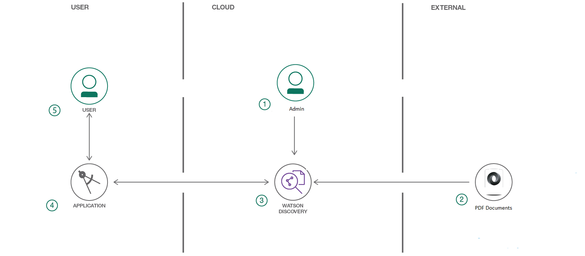
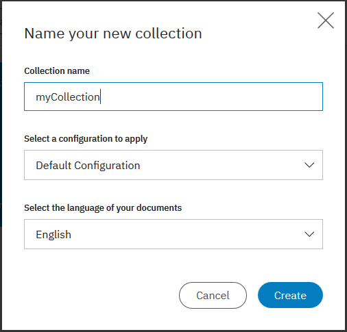

[](https://travis-ci.org/IBM/virtualhelpdesk)

# Ingesting segments in PDF file into Watson Discovery

In this Code Pattern, we walk you through configuration steps of Watson Discovery service in order to split segments in PDF documents and ingest them into Discovery service as individual document automatically. It eliminates the manual tasks of splitting PDF file as it can be part of the common customer requirements. 

Splitting and ingesting each segment in a PDF file as individual document can improve query efficency and identify information more procisely. 

After Discovery service configuration, an example web application is used to view and verify the outcome. You only need part of the web application for this code pattern although it contains multiple UI components. 

Optionally, Watson Knowledge Studio model can be deployed to Discovery service to improve data ingestion and query.

When reader completes this Code Pattern, they will understand how to:
* Configure a Watson Discovery service to automatically split PDF file and ingest them as inidvidual documents
* Load and enrich data in the Watson Discovery Service.
* Query and manipulate data in the Watson Discovery Service.



## Flow
1. Administrator configures Watson Discovery service.
1. PDF files are loaded into Discovery collection. Segments in PDF files are ingested into Discovery collection as individual documents.
1. Enhanced data in Discovery collection is rendered to web aplication.
1. Each segment in the PDF documents can be presented in web application.
1. The user interacts with the data in Discovery server via the app UI.


## Included components
* [Watson Discovery](https://www.ibm.com/watson/developercloud/discovery.html): A cognitive search and content analytics engine for applications to identify patterns, trends, and actionable insights.
* [Watson Discovery Configuration](https://console.bluemix.net/docs/services/discovery/building.html#configuring-your-service): Split segments in PDF files and ingest them as individual documents into Discovery collection.

## Featured technologies
* [Cognitive](https://developer.ibm.com/watson/): Watson is a cognitive technology that can think like a human.
* [Node.js](https://nodejs.org/en/): An asynchronous event driven JavaScript runtime, designed to build scalable applications.

# Watch the Video

[](https://youtu.be/gzlUSyLccSg)


# Discovery Collection Configuration

You can split your Word, PDF, and HTML documents into segments based on HTML heading tags. Once split, each segment is a separate document that will be enriched and indexed separately. Since queries will return these segments as separate documents, document segmentation can be used to:

* Perform aggregations on individual segments of a document. For example, your aggregation would count each time a segment mentions a specific entity, instead of only counting it once for the entire document.
* Perform relevancy training on segments instead of documents, which will improve result reranking.

The segments are created when the documents are converted to HTML (Word and PDF documents are converted to HTML before they are converted to JSON). Documents can be split based on the following HTML tags: h1 h2 h3 h4 h5 and h6.

Considerations:

* Segmentation isenabled only via the API in the conversions section when the code pattern is written.

* The number of segments per document is limited to 250. Any document content remaining after 249 segments will be stored within segment 250.

* Each segment counts towards the document limit of your plan. Discovery will index segments until the plan limit is reached. See Discovery pricing plans for document limits.

* You can not normalize data (see Normalizing data) or use CSS selectors to extract fields (see Using CSS selectors to extract fields) when using document segmentation.

* Documents will segment each time the specified HTML tag is detected. Consequently, segmentation could lead to malformed HTML because the documents could be split before closing tags and after opening tags.

* HTML, PDF, and Word metadata, as well as any custom metadata, is extracted and included in the index with each segment. Every segment of a document will include identical metadata.

* Document segmentation is not supported when the Element Classification (elements) enrichment is specified.

* Re-ingesting a segmented document has additional considerations, see Updating a segmented document.


# Steps

1. [Clone the repo](#1-clone-the-repo)
2. [Create IBM Cloud service](#2-create-ibm-cloud-services)
3. [Create Discovery Collection](#3-create-discovery-collection)
4. [Configure credentials](#4-configure-credentials)
5. [Run the application](#5-run-the-application)
6. [Deploy and run the application on IBM Cloud](#6-deploy-and-run-the-application-on-ibm-cloud)


## 1. Clone the repo
```
git clone https://github.com/IBM/virtualhelpdesk
```


## 2. Create IBM Cloud service

Create a Discovery service instance:

* [**Watson Discovery**](https://console.ng.bluemix.net/catalog/services/discovery)


## 3. Create Discovery Collection

Launch the **Watson Discovery** tool. Click on **Upload your own data** link to create a **new data collection**. Enter a unique name.



> Save the **environment_id** and **collection_id** for your `.env` file in the next step. You can find this data by clicking on `Use this collection API` under the **Collection Info** header located at the top right portion of the panel.


## 4. Configure credentials

To configure the web application,
```
cp env.sample .env
```
Edit the `.env` file with the necessary settings.
* DISCOVERY_URL
* DISCOVERY_ENVIRONMENT_ID
* DISCOVERY_COLLECTION_ID
* DISCOVERY_USERNAME
* DISCOVERY_PASSWORD
* DISCOVERY_CONFIGURATION_FILE

#### `env.sample:`

```
# Copy this file to .env and replace the credentials with
# your own before starting the app.

# Watson Discovery
DISCOVERY_VERSION_DATE="2018-03-05"
DISCOVERY_URL=<add_discovery_url>
DISCOVERY_ENVIRONMENT_ID=<add_discovery_environment_id>
DISCOVERY_COLLECTION_ID=<add_discovery_collection_id>

## Un-comment and use either username+password or IAM apikey.
# DISCOVERY_IAM_APIKEY=<add_discovery_iam_apikey>
DISCOVERY_USERNAME=<add_discovery_username>
DISCOVERY_PASSWORD=<add_discovery_password>
DISCOVERY_CONFIGURATION_FILE=pdfSegmentConfig.json

# Run locally on a non-default port (default is 3000)
# PORT=3000
```

## 5. Run the application

1. Install [Node.js](https://nodejs.org/en/) runtime or NPM.
2. Install required Node.js modules

```
npm install
```

3. Start the app.

```
 npm start
```

4. Access the UI by pointing your browser at `localhost:3000`.
> Note: `PORT` can be configured in `.env`.


## 6. Deploy and run the application on IBM Cloud

To deploy to the IBM Cloud, make sure have the [IBM Cloud CLI](https://console.bluemix.net/docs/cli/reference/bluemix_cli/get_started.html#getting-started) tool installed. Then run the following commands to login using your IBM Cloud credentials.

```
cd segment-pdf-discovery
ibmcloud login
```

To set the `Org` and `Space` in IBM Cloud environment,

```
ibmcloud target --cf
```

When pushing your app to the IBM Cloud, values are read in from the [manifest.yml](manifest.yml) file. Edit this file if you need to change any of the default settings, such as application name or the amount of memory to allocate.

```
---
applications:
- path: .
  name: segment-pdf-discovery
  buildpack: sdk-for-nodejs
  memory: 1024M
  instances: 1
```

To deploy your application, run the following command.

```
$ ibmcloud cf push
```

> NOTE: The URL route assigned to your application will be displayed as a result of this command. Note this value, as it will be required to access your app.

To view the application, go to the IBM Cloud route assigned to your app. Typically, this will take the form `https://<app name>.mybluemix.net`.

To view logs, or get overview information about your app, use the IBM Cloud dashboard.


# Troubleshooting

If you encounter a problem, you can check the logs for more information. To see the logs, run the `cf logs` command:

```bash
cf logs <application-name> --recent
```


## License

This sample code is licensed under Apache 2.0. Full license text is available in [LICENSE](LICENSE).


# Links

* [Watson Node.js SDK](https://github.com/watson-developer-cloud/node-sdk): Download the Watson Node SDK.
* [Discovery Search UI](https://github.com/IBM/watson-discovery-ui): A sample UI that this repo is based on.


# Learn more

* [Cloud_Foundry CLI](https://github.com/cloudfoundry/cli#downloads)
* [Watson Discovery Documentation](https://console.bluemix.net/docs/services/discovery/getting-started.html#gettingstarted)
* [Node.JS](http://nodejs.org/)
* [NPM](https://www.npmjs.com/)
* **With Watson**: Want to take your Watson app to the next level? Looking to utilize Watson Brand assets? [Join the With Watson program](https://www.ibm.com/watson/with-watson/) to leverage exclusive brand, marketing, and tech resources to amplify and accelerate your Watson embedded commercial solution.

